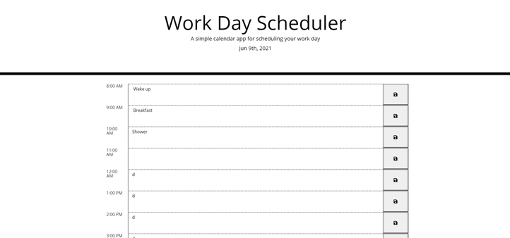

# Workday Calander

# Discription 
Creating a simple calendar application that allows a user to save events for each hour of the day by modifying starter code. This app will run in the browser and feature dynamically updated HTML and CSS powered by jQuery. 

# Table Content

[Discription]()

[Deployed-Link]()

[MockUp]()

[UserStory]()

[AcceptanceCriteria]()

[Technologies]()

[Questions]()

[Acknowledgments]()

# Technologies
HTML
CSS
Java Script
JQuery
Moment

# Deployed Link

https://kelebetengida.github.io/Workday-Calander-/

# Mock up

</img>

# User Story
- AS AN employee with a busy schedule
- I WANT to add important events to a daily planner
- SO THAT I can manage my time effectively

# Acceptance Criteria

-This workday calendar display work hours of the day 8AM - 5PM.
-On the top of the page, current day and date is diplayed.
-Each time block is color coded to indicate whether it occurs in the past(gray), present(red), or future(green).
-Each time block has an input field and save button where users can store their schedule.
-Once it saved, it will store in their local storage.
-This calendar is desktop and mobile compatible.

## Questions

GitHub: [github.com/kelebetengida]()

Email: [engidk@uw.edu]()

## Acknowledgments

Thankkyou to my instractors who have helped me through the learning curve of this project. 
